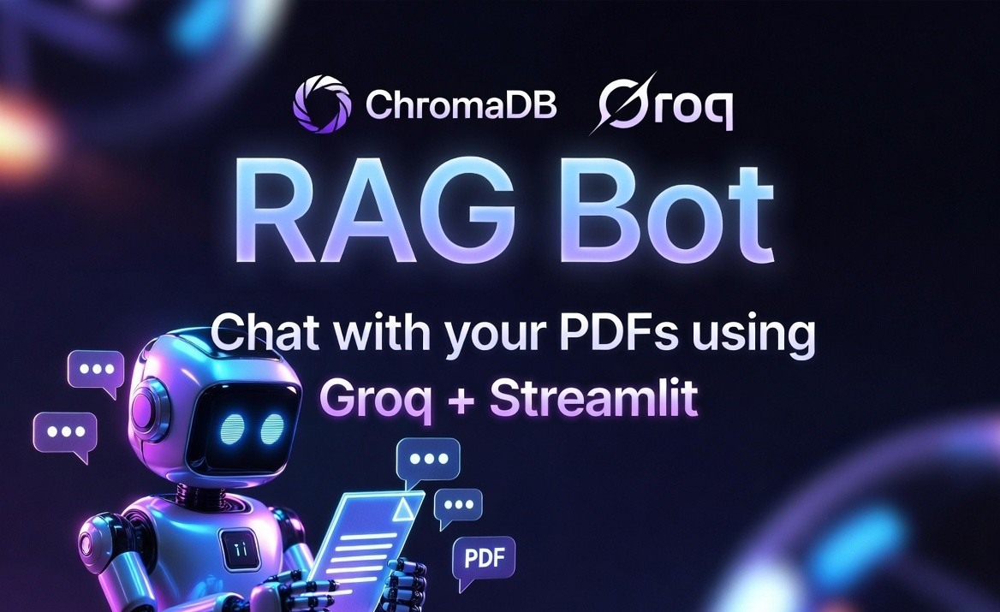
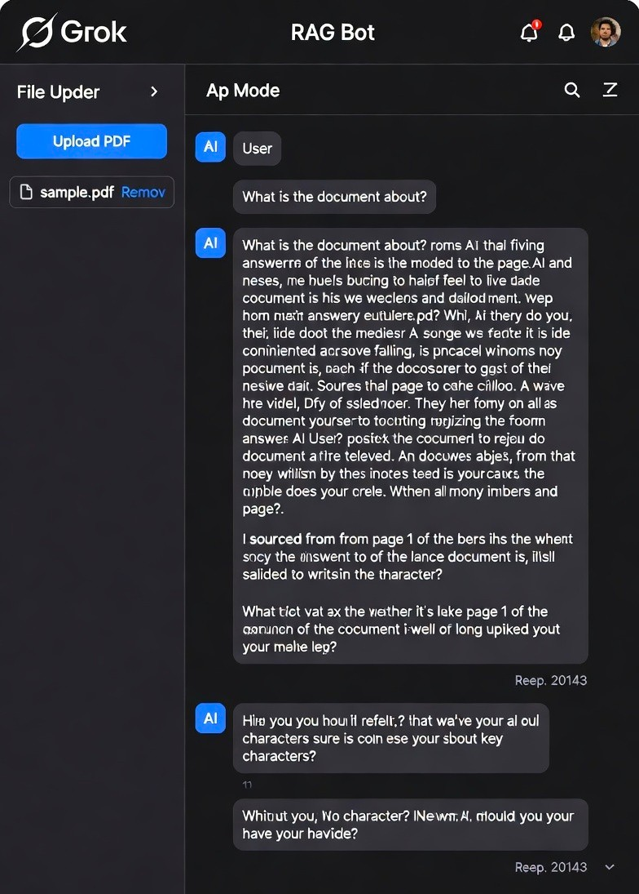
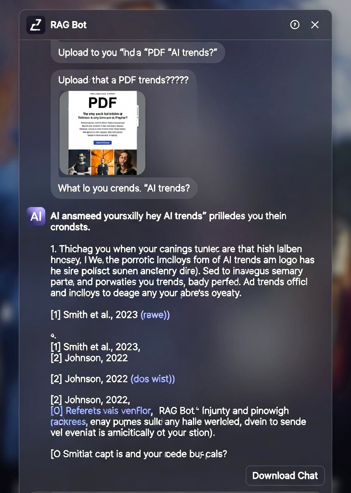
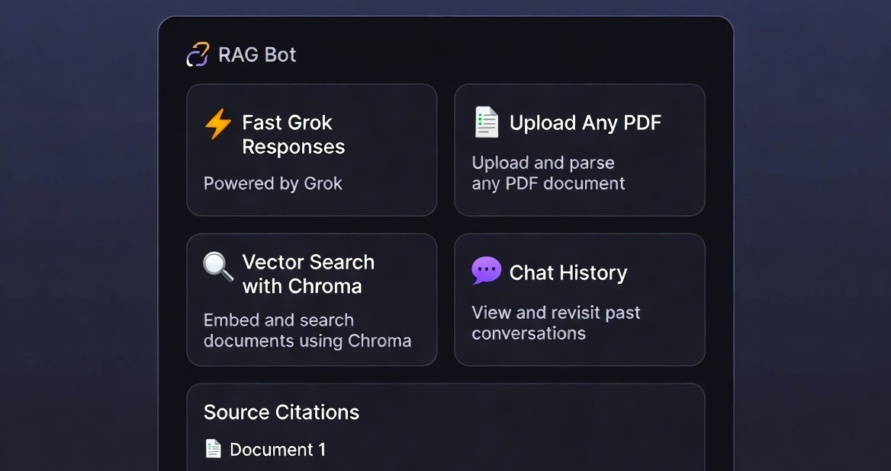
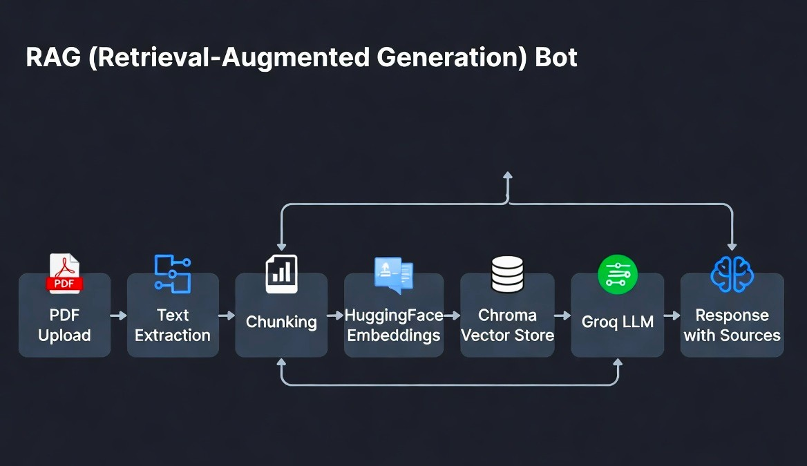

<div align="center">



# 🚀 GROQ RAG ChatBot

**Chat with your PDFs — Blazing Fast with Groq**

[](https://www.python.org/)
[](https://streamlit.io/)
[](https://groq.com/)
[](https://www.trychroma.com/)

</div>

---

### ✨ Live Demo







---

## 📋 What It Does

This is a **Retrieval-Augmented Generation (RAG)** chatbot that lets you upload PDF documents and have intelligent conversations with them.

**Powered by**:

- **Groq** → Ultra-fast LLM inference
- **Hugging Face Embeddings**
- **ChromaDB** → Vector database
- **Streamlit** → Beautiful UI

---

## 🛠️ Architecture



---

## 🚀 Features

- ✅ Upload one or multiple PDFs
- ✅ Smart chunking & embedding
- ✅ Fast responses powered by Groq
- ✅ Source citations with document references
- ✅ Chat history download
- ✅ Vector database inspector
- ✅ Clean, responsive dark UI

---

## 📂 Project Structure

```bash
rag-bot/
├── index.py                 # Main Streamlit app
├── requirements.txt         # Dependencies
├── .env.example             # Environment variables template
├── images/                  # README images
│
└── modules/
    ├── pdf_handler.py       # PDF upload & processing
    ├── vectorstore.py       # ChromaDB operations
    ├── llm.py               # Groq LLM + Retrieval chain
    ├── chat.py              # Chat logic & history
    └── chroma_inspector.py  # DB inspection tool
```

⚙️ Getting Started
1️⃣ Clone the Repository

git clone https://github.com/ojasss11/rag-bot.git
cd rag-bot

2️⃣ Create Virtual Environment
python -m venv venv

# Windows

venv\Scripts\activate

# macOS / Linux

source venv/bin/activate

3️⃣ Install Dependencies

pip install -r requirements.txt

4️⃣ Setup Environment Variables
Copy .env.example to .env and add your keys:

GROQ_API_KEY=your_groq_api_key_here
HUGGINGFACEHUB_API_TOKEN=your_hf_token_here

5️⃣ Run the App

streamlit run index.py

🗝️ Important Notes

Never commit your .env file
To reset the vector database → delete the chroma_store folder
Works best with Groq's Llama3-70b or Mixtral models


